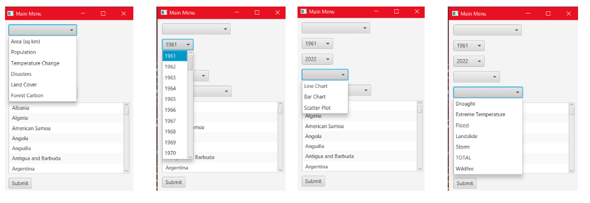
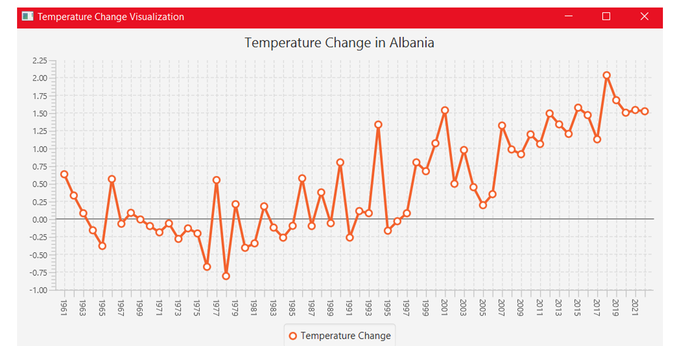
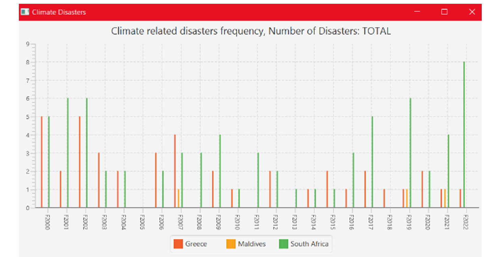

## **Visualization of data about Countries.**

## Demo Video
Demo video, in Greek, is in 4 parts on Youtube: https://www.youtube.com/watch?v=di--13gMfuU&list=PLADjsxMYD7_2xvngXH9vxImTL8wkVkZpE&ab_channel=ThemisS

Unfortunately, i couldn't capture in one video the whole Application, because i couldn't change apps. Because of that in the end the results aren't shown.
There are some examples of the results in the FinalReport.pdf, a report written in Greek.

## Features
- Interactive menu for selecting countries, indicators, and time ranges
- Multiple chart types: Line Chart, Bar Chart, Scatter Plot
- Ability to compare multiple countries
- Visualizations for specific indicators including temperature change, land cover, forest carbon, and disasters

## Technologies Used
- Java
- Eclipse
- MySQL for the database
- JavaFX for GUI
- JDBC for database connectivity

## Prerequisites
- Java Development Kit (JDK) 17.0.10
- Eclipse 2020-09
- MySQL Server
- JavaFX SDK
- MySQL Connector/J (JDBC driver)

## How to run
To confirm proper operation:
- First: Right click on "MainApp.java" -> Run as -> Run Configurations
- In the window that opens, select the “Arguments” tab and 
in VM arguments, select Variables. 
- Click edit variables → New: --module-path
"C:/Users/path of javafx library/javafx-sdk-22.0.1/lib" --add-modules
javafx.controls,javafx.fxml
- Apply
- Close

Afer the confirmation:
- Right click on "MainMenu.java" and Run as Java Application.

## Usage
Consider you want to see the Temperature Changes in Albania from 1961 to 2022.
In the first window that appears you select these:
- First selection is the indicator: **Temperature Change**
- Second selection is start date (default is 1961): **1961**
- Third selection is end date (default is 2022): **2022**
- Fourth selection is graph type: **Line Chart**
- Fifth selection is type of natural disaster (available only if indicator = Disasters): -
- Last window is the countries (multiple choice option with CTRL button pressed): **Albania**

  

Tap "Submit" button

A chart graph appears on screen with the results.

  

We can also select multiple Countries to compare. For example:
- First selection is the indicator: **Disasters**
- Second selection is start date (default is 1961): **2000**
- Third selection is end date (default is 2022): **2022**
- Fourth selection is graph type: **Bar Chart**
- Fifth selection is type of natural disaster (available only if indicator = Disasters): **TOTAL**
- Last window is the countries (multiple choice option with CTRL button pressed): **Greece**, **Maldives**, **South Africa**

Tap "Submit" button.
A bar chart appears on screen with the results.

  

## Project Developer
- Themistokleia Siakavara, 4786
